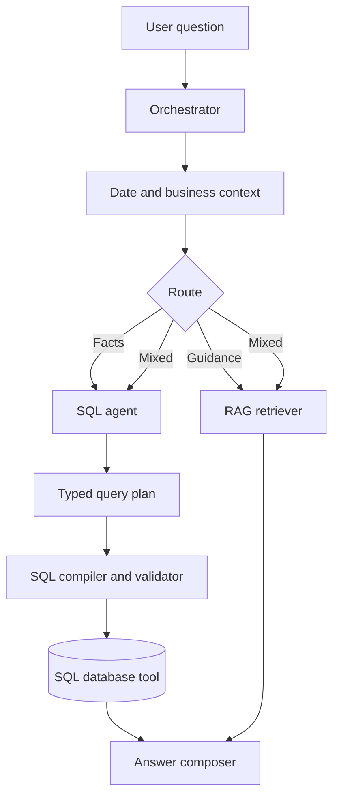

# BrainWave Bot prototype

BrainWave turns a natural-language business question into a governed database
answer. The end-to-end path is:



## What this slice demonstrates

- **Orchestrator:** routes a question to SQL, RAG, or both.
- **LangChain composition:** LCEL `RunnableLambda` components define the
  context and retrieval hand-offs; `ChatOpenAI` provides typed planning and
  answer synthesis through OpenRouter when a key is configured.
- **Date/business context:** maps `stories`/`ideas` to submissions, corrects
  `NEMIA` to `EMEA`, and resolves `FY26` or `current year` using an April–March
  fiscal calendar.
- **SQL agent:** uses a LangChain-compatible OpenRouter chat model to produce a
  typed `QueryPlan`. Without a key, a deterministic parser provides a runnable
  demo path.
- **Governed SQL generation:** compiles the plan into parameterized SQL. The
  LLM does not receive a raw database connection.
- **SQL tool:** parses SQL with `sqlglot`, permits a single read-only `SELECT`,
  enforces a table allowlist and market access scope, then runs against SQLite.
- **RAG:** uses LangChain's in-memory vector store and deterministic local hash
  embeddings for business documentation. Replace these embeddings and the
  store for production.
- **Answering:** OpenRouter formulates the final answer when configured; the
  deterministic mode still proves the complete control flow.

## Quick start

Python 3.11 or newer is required.

```bash
python -m venv .venv
source .venv/bin/activate              # Windows: .venv\Scripts\activate
pip install -r requirements.txt
cp .env.example .env.local
```

Add your OpenRouter key to `.env.local`:

```dotenv
OPENROUTER_API_KEY=your_key_here
OPENROUTER_MODEL=openai/gpt-4.1-mini
```

Never commit `.env.local`; it is already ignored.

Run a question and inspect the complete trace:

```bash
PYTHONPATH=src python -m brainwave_bot.app \
  --json "How many stories were submitted in NEMIA during FY26?"
```

Expected demo result: **3 unique EMEA submissions in FY26**. The trace exposes
the resolved date range, generated parameterized SQL, bound values, returned
rows, and each component hand-off.

Try the RAG path:

```bash
PYTHONPATH=src python -m brainwave_bot.app --json "What is BrainWave?"
```

Try both paths in one turn:

```bash
PYTHONPATH=src python -m brainwave_bot.app --json \
  "What is BrainWave, and how many ideas were submitted in EMEA in FY26?"
```

Run the HTTP API:

```bash
PYTHONPATH=src uvicorn brainwave_bot.app:api --reload
curl -X POST http://127.0.0.1:8000/ask \
  -H "Content-Type: application/json" \
  -d '{"question":"How many approved ideas were submitted in EMEA during FY26?"}'
```

Run tests:

```bash
pytest -q
```

## Change the fiscal year logic

Set `BRAINWAVE_FISCAL_START_MONTH` in `.env.local`. For a January–December
calendar, use `1`; for the supplied April–March calendar, use `4`. The resolver
in `src/brainwave_bot/context.py` calculates the date range dynamically, so no
year-specific code change is required.

## Security boundary

The prototype deliberately separates interpretation from execution:

1. The model produces a Pydantic query plan with enumerated metrics and
   dimensions.
2. Application code compiles that plan into SQL with named parameters.
3. The tool parses the SQL AST, checks read-only behavior and allowlisted tables,
   and validates market authorization.
4. SQLite opens in read-only mode for execution.

For production, add identity-derived RLS predicates, Azure SQL/SQL Server with a
read-only service principal, query timeouts/cost limits, audit logs, PII
redaction, prompt-injection testing, semantic retrieval embeddings, evaluation
datasets, and observability.

## Project map

```text
src/brainwave_bot/
  orchestrator.py  Route selection and final composition
  context.py       Business terms and fiscal-date resolution
  rag.py           LangChain in-memory retrieval
  sql_agent.py     Typed planning and safe SQL compilation
  sql_tool.py      AST validation, authorization, and execution
  app.py           CLI and FastAPI entry points
data/business_context.yaml
knowledge/brainwave.md
tests/test_brainwave.py
```
